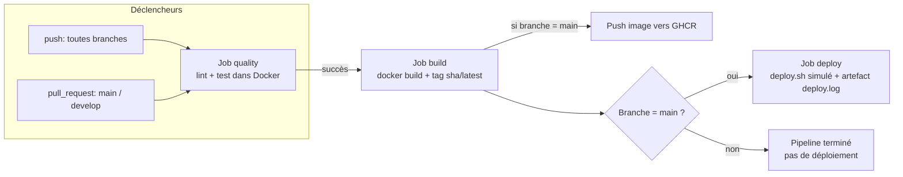

benjaminponey/EC06-skillhub-api

# SkillHub API — CI/CD avec GitHub Actions et Docker (EC06)

Mini API Express (Node.js 20) industrialisée avec une chaîne Git → Docker → GitHub Actions,
dans le cadre de l'épreuve EC06 (Bloc 3 · Architectures).

## Endpoints

* `GET /` : message d'accueil.
* `GET /health` : retourne le statut de l'API (`{ status: 'ok', service: 'skillhub-api' }`).

## Scripts npm

```bash
npm install            # installer les dépendances
npm start              # démarrer le serveur sur le port 3000
npm test               # lancer la suite de tests Jest
npm run lint           # vérifier le code avec ESLint
```

---

## 1. Workflow Git et Docker

### Stratégie de branches

Stratégie retenue : **Trunk-Based simplifié**.

* `main` : branche protégée, toujours déployable. Les status checks GitHub Actions
  `Quality (lint + test)` et `Build image Docker` sont **requis** avant tout merge, et le
  force-push est bloqué (voir capture `docs/captures-ci/03-branch-protection.png`).
* `feature/<nom>` : branches éphémères créées pour chaque évolution (ex. `feature/dockerfile`,
  `feature/ci-pipeline`), fusionnées dans `main` via Pull Request puis supprimées.

**Justification** : l'épreuve est individuelle et se déroule sur une durée courte (4h). Une
branche `develop` intermédiaire (GitFlow complet) n'apporte pas de valeur sans travail d'équipe
à coordonner ni de cycle de release différé — elle aurait surtout ajouté une étape de merge
supplémentaire sans bénéfice. Le Trunk-Based avec branches `feature/*` courtes garde un
historique linéaire et lisible tout en conservant le garde-fou principal recherché : aucune
modification ne part sur `main` sans passer par une PR dont la CI est au vert.

### Dockerfile multistage

Le `Dockerfile` est construit en deux étapes :

| Étape | Image de base | Rôle |
|---|---|---|
| `builder` | `node:20-alpine` | Installe **toutes** les dépendances (dont dev : ESLint, Jest) pour permettre le lint et les tests. |
| `final` | `node:20-alpine` | Image de production : installe uniquement les dépendances de prod (`npm install --omit=dev`) puis copie le code source. |

Points clés de l'étape `final` :

* **Utilisateur non-root** : création explicite d'un utilisateur système `skillhub` (`addgroup`/`adduser`), activé via `USER skillhub` avant le `CMD`.
* **`EXPOSE 3000`** : documente le port exposé par l'API.
* **`HEALTHCHECK`** : effectue une requête HTTP sur `/health` toutes les 30s (timeout 5s, 3 tentatives) et échoue si le code de retour n'est pas `200`.
* Le contexte de build est allégé par `.dockerignore` (exclut `node_modules`, `docs/`, `.github/`, les fichiers `.md`, etc.).

Le service `app` du `docker-compose.yml` cible volontairement l'étape **`builder`** (et non `final`) : c'est cette image, qui contient ESLint et Jest, qui est utilisée par la CI pour exécuter `npm run lint` et `npm test` dans un conteneur reproductible. L'image `final`, elle, ne sert qu'à la publication (job `build` de la CI), puisqu'une image de production n'a pas besoin d'outils de développement.

### docker-compose

`docker-compose.yml` définit deux services :

* **`app`** : construit depuis le `Dockerfile` (étape `builder`), écoute sur le port `${PORT:-3000}`, charge ses variables via `env_file: .env`, démarre après que la base de données soit *healthy*.
* **`db`** : `postgres:16-alpine`, configuré via les mêmes variables d'environnement, avec un **volume nommé** (`db-data`) pour la persistance des données et un `healthcheck` (`pg_isready`).

Le fichier `.env.dist` (versionné) documente toutes les variables attendues ; `.env` (réel, avec les valeurs locales) est ignoré par Git via `.gitignore`.

Démarrage local en une seule commande :

```bash
cp .env.dist .env
docker compose up
```

---

## 2. Architecture du pipeline CI/CD

Le workflow `.github/workflows/ci.yml` est déclenché sur **chaque `push`** (toutes branches) et sur les **`pull_request`** ciblant `main` ou `develop` (bonus). Il enchaîne 3 jobs :



Détail des jobs :

1. **`quality`** (`Quality (lint + test)`) : recrée `.env` depuis `.env.dist`, puis exécute `docker compose run --rm app npm run lint` et `docker compose run --rm app npm test`. Le job échoue si le lint ou un test échoue. Nettoyage systématique des conteneurs (`docker compose down -v`) même en cas d'échec.
2. **`build`** (`Build image Docker`, dépend de `quality`) : construit l'image finale (`docker build .`, étape `final`), la tague avec le SHA court du commit et `latest`. Sur `main` uniquement, elle est poussée vers **GitHub Container Registry** (`ghcr.io`).
3. **`deploy`** (`Deploy (simulé)`, dépend de `build`, uniquement sur `main`) : exécute `deploy.sh`, qui affiche les commandes qu'un déploiement réel aurait lancées et écrit `deploy.log`, publié comme artefact GitHub Actions.

Un run vert (3 jobs) et la configuration de protection de branche associée sont visibles dans `docs/captures-ci/`.

---

## 3. Gestion des secrets

| Secret / variable | Où il est défini | Comment il est injecté |
|---|---|---|
| `GITHUB_TOKEN` | Fourni automatiquement par GitHub Actions (pas à créer) | Utilisé pour l'authentification à GHCR (`docker/login-action`) et déclaré explicitement dans `permissions: packages: write` du workflow, avec un scope minimal (`contents: read`) |
| `POSTGRES_PASSWORD`, `POSTGRES_USER`, `POSTGRES_DB`, `PORT` | **Localement** : fichier `.env` (non versionné) créé à partir de `.env.dist`. **En CI** : recréé à la volée par l'étape `cp .env.dist .env`, avec les valeurs par défaut du `.env.dist` (pas de données sensibles réelles) | Chargées par `docker-compose.yml` via `env_file` |

Vérifications appliquées :

* `.env` figure dans `.gitignore` (`grep .env .gitignore` → présent) : il n'a **jamais** été commité.
* `.env.dist` ne contient que des valeurs de démonstration (`change-me-in-local-env`), jamais de vrai secret.
* Aucun `echo` ou `run` du workflow n'affiche la valeur d'un secret dans les logs.
* Le job `build` ne pousse l'image (avec authentification GHCR) que sur `main`, jamais sur les branches `feature/*`, ce qui limite l'exposition des credentials aux seuls runs de confiance.

---

## 4. Instructions et limites

### Lancer le projet en local

```bash
git clone git@github.com:benjaminponey/EC06-skillhub-api.git
cd EC06-skillhub-api
cp .env.dist .env
docker compose up
# API disponible sur http://localhost:3000/health
```

Lancer le lint / les tests dans les mêmes conditions que la CI :

```bash
docker compose run --rm app npm run lint
docker compose run --rm app npm test
```

### Ce qui n'a pas été fait

* Pas de scan de vulnérabilités de l'image Docker (Trivy / Docker Scout / Grype).
* Pas de vérification formalisée de la taille de l'image finale (< 200 Mo) ni d'image `distroless`.
* Pas de cache des dépendances npm dans le job CI (`actions/cache` ou cache Docker layers dédié).
* Pas de matrice de build sur plusieurs versions de Node (l'API cible uniquement Node 20).
* Pas de badge de statut CI dans ce README.
* Déploiement réel (SSH / PaaS) non mis en place : le job `deploy` reste simulé (`deploy.sh` + `deploy.log`).

### Améliorations futures envisageables

* Ajouter un scan Trivy en job dédié après `build`, bloquant sur les vulnérabilités critiques.
* Restreindre davantage `permissions:` du `GITHUB_TOKEN` par job (principe du moindre privilège).
* Passer à un déploiement réel sur un PaaS gratuit (Render/Fly.io/Railway) avec **GitHub Environments** pour séparer les secrets de production des secrets de CI.
* Mettre en cache les dépendances npm et les layers Docker pour réduire le temps du job `quality`.
* Automatiser le versionnement des releases (tags sémantiques + changelog généré) à partir de `main`.
